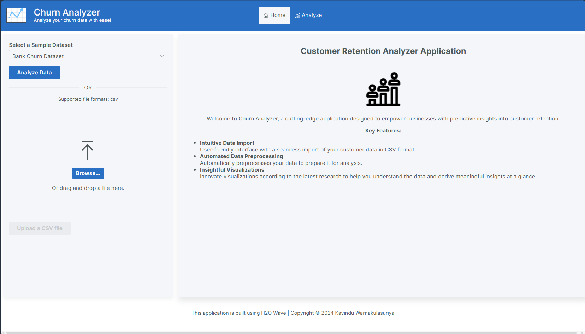
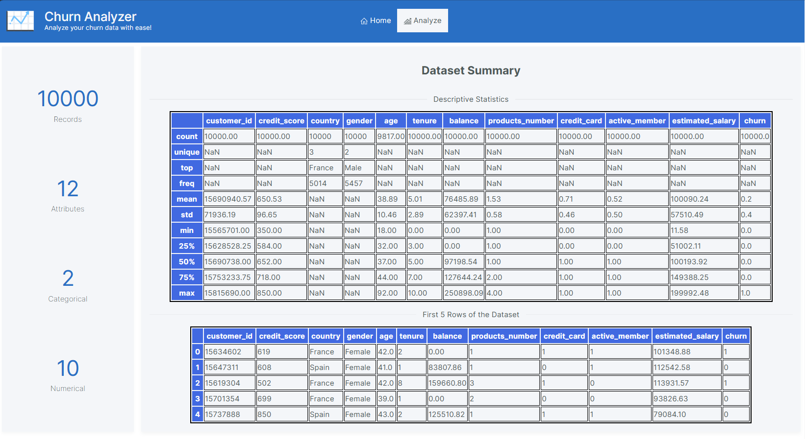
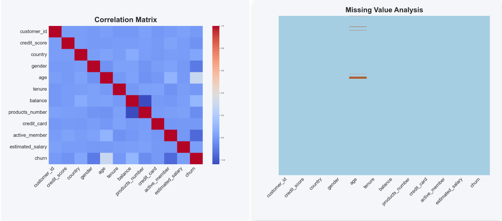
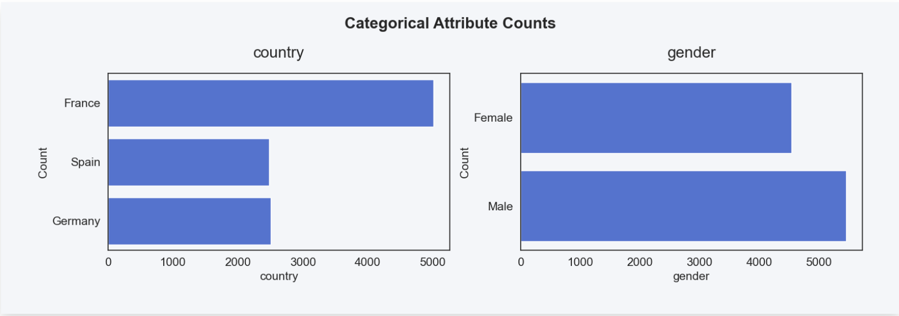
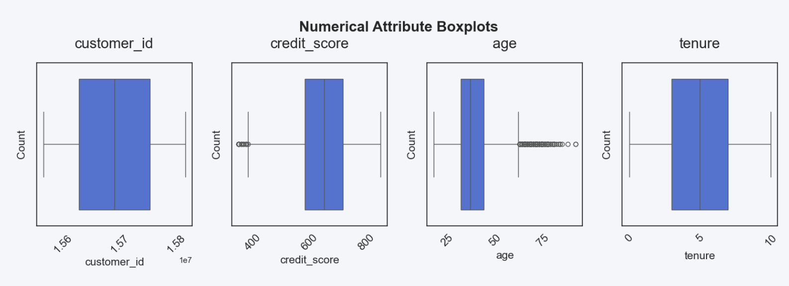
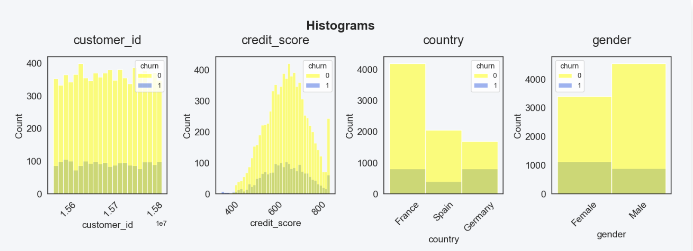

# Churn Analyzer App

## Overview

The Churn Analyzer App is a tool designed to help businesses analyze customer churn. By analyzing customer data, the app provides insights into the likelihood of customers leaving the service, enabling proactive measures to retain them.

## Installation

To install and run the Churn Analyzer App, follow these steps: (Virtual environment is recommended)

1. **Install requirements**:
   ```bash
   pip install -r requirements.txt
   ```
2. **Run the App**:
   ```bash
   wave run src.app
   ```

## Usage

The Churn Analyzer App is a web-based application that can be accessed through a web browser. The app provides an interactive interface to upload and analyze customer data.

1. **Upload Data**:
   - Upload a CSV file containing customer data.
   - The app will automatically detect the columns in the dataset and display them for selection.
   - Alternatively, you can use the sample datasets provided in the app.
2. **Analyze Data**:
   - The app will analyze the data and provide insights including:
     - Data Summary
     - Correlation Analysis
     - Missing Values Analysis
     - Categorical Features Analysis
     - Numerical Features Analysis
     - Histograms with respect to the target variable (Churn)

## Screenshots

### Home Page


### Analysis Page

#### Data Summary


#### Correlation and Missing Values Analysis


#### Categorical Features Analysis


#### Numerical Features Analysis


#### Histograms


## Icon Attribution

All the icons used in the Churn Analyzer App are from [ICONS8](https://icons8.com/).

## Data Attribution
The dataset used in the Churn Analyzer App is from,
1. [Kaggle Bank Churn Dataset](https://www.kaggle.com/datasets/gauravtopre/bank-customer-churn-dataset)
2. [Kaggle Telco Churn Dataset](https://www.kaggle.com/datasets/reyhanarighy/data-telco-customer-churn)

Some of the data has been modified for the purpose of this app and the datasets are only used for educational purposes.

## Contributing

Contributions are welcome! Please fork the repository and submit a pull request with your changes.

## Contact

For any inquiries or support, please contact [akwarnakulasuriya@gmail.com](mailto:akwaranakulasuriya@gmail.com).

---

Thank you for checking out the Churn Analyzer App!